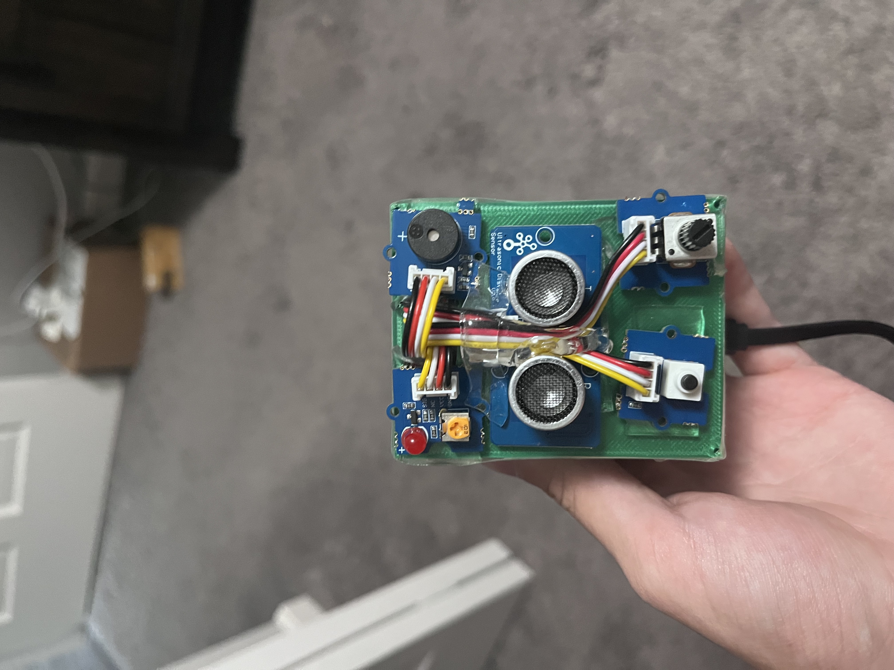

# Motion Detector
Works by detecting objects within a certain distance; if they are too close, a buzzer will go off. The sensitivity can be adjusted via a rotary dial, and the system can be enabled/disabled with the press of a button. An indicator light has been added to show status of the device (enabled/disabled).

Another feature is that because it uses ultrasonic beams, it causes audio distortion for microphones. Check out the demo video and you can hear it.

## Hardware Details
This project was built using a grove kit:
```
- 1 Grove Base Shield
- 5 Grove Cables
- 1 Grove Ultrasonic Ranger
- 1 Grove Buzzer
- 1 Grove LED Module
- 1 Grove Button
- 1 Grove Rotary Potentiometer
- 1 Case (Find case.stl in root directory)
- Double Sided Tape (Holds case together and attaches parts)
```

## Pinout Scheme
```
  LED Pin - 6
  Button Pin - 2
  Ultrasonic Ranger Pin - 4
  Rotary Potentiometer Pin - A2
  Buzzer Pin - 5
```

## Build Requirements
 - Platformio cli

## Build
To build the project, open it in terminal and run `platformio run --target upload --upload-port /dev/cu.usbserial-0001` (change `/dev/cu.usbserial-0001` to the correct port).

## Picture & Demo Video
 [](https://youtube.com/shorts/46SMoDRWZgU)
